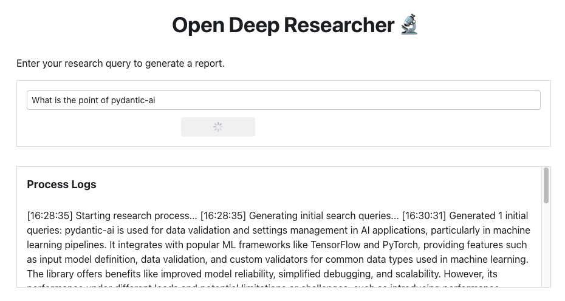

# Deep Research Alternative

This was started off of the [reflex example](https://github.com/reflex-dev/reflex-llm-examples/tree/main/open_deep_researcher) but meant to be run locally.



# Usage

To start, either run models locally or create ssh tunnel to remote Ollama models

```bash
ssh -L 11434:localhost:11434 -N ollamaserver
```

either set the env variables or use the included `.env.sample`:

```
❯ mise run show:secrets
[show:secrets] $ cat .env
JINA_API_KEY = "[redacted]"
SERPAPI_API_KEY = "[redacted]"
FIRECRAWL_API_KEY = "[redacted]"
```

in another terminal, start the reflex server:

```bash
uv run reflex run
```

## Differences

- Use `pydantic_ai` for LLM interactions, allows multiple agents/providers which should be configurable through the app.
- Migrate to self-hosted alternative to jinaai and serpai, possible either a model or some alternative like:
  - https://github.com/intergalacticalvariable/reader
  - https://docs.firecrawl.dev/introduction

# Other `Deep Research` Alternatives

- https://github.com/dzhng/deep-research
  - typescript and cli
- https://github.com/epuerta9/deep-research-py/
  - python and cli
- https://github.com/pydantic/pydantic-ai/issues/901
- https://github.com/assafelovic/gpt-researcher
  - python, predates Deep Research
- https://huggingface.co/blog/open-deep-research

# Notes / TODO

- Using the `result_type` argument of `run`/`agent` doesnt seem to work when trying to cast the result for the models used. Should ideally be fixed but no obvious ways I've tried have worked.
- Should move the tool usage and delegation to [agent delegation](https://ai.pydantic.dev/multi-agent-applications/#agent-delegation)

# Templates

- I am deciding if i should use toml for the templates or python files that i can define the `result_type` for the agent/model in as well.
- Toml is nice since simplifies
